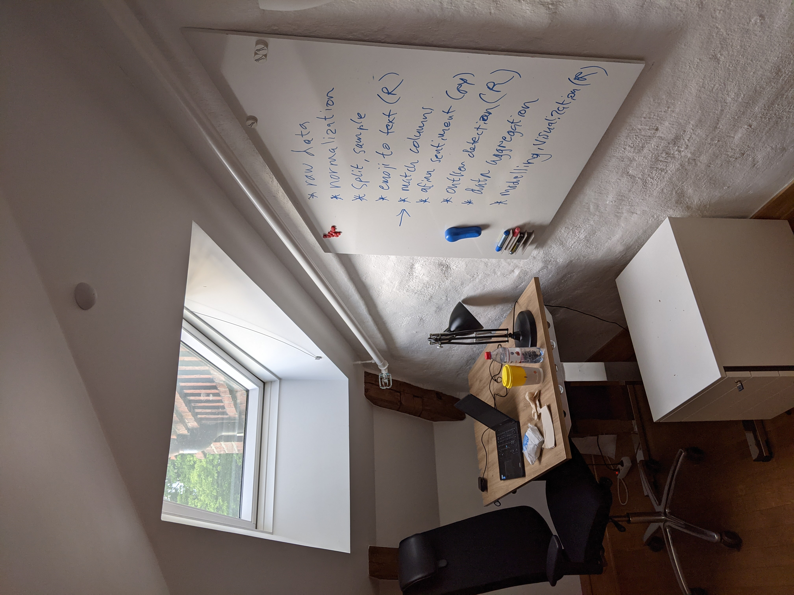

# data processing pipeline
some intro here

## raw data dump (sh)
- from crowdtangle ?
- facebook, ca 350K rows
- instagram, ca 350K rows

## normalize raw data (sh) 
- records, fix newlines
- delimiters, insert tabs
- unique record id, post id
- facebook, ca 100K rows

## split, sample (sh)
- 100K into 10K chunks
- randomize row order

## emojis to text (R)
- handle emojis in posts
- convert emoji to text

## match columns, rows
- to original 2018 dataset
- reassemble 100K rows

## sentiment analysis (py)
- afinn dictionary
- english for emoji text
- swedish for post text

## outlier detection (R)
- 1.5 interquartile range
- standardize, normalize measures

## data aggregation (R)
- 100K rows by 60 months

## modelling, visualization (R)
- linear models
- scatter plots

pufen

