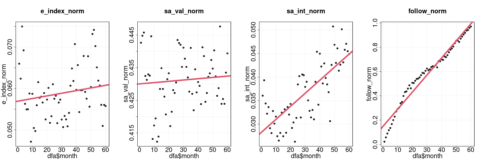
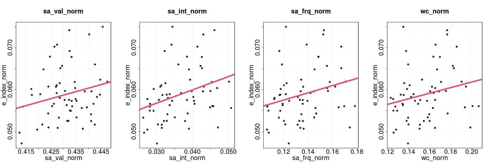
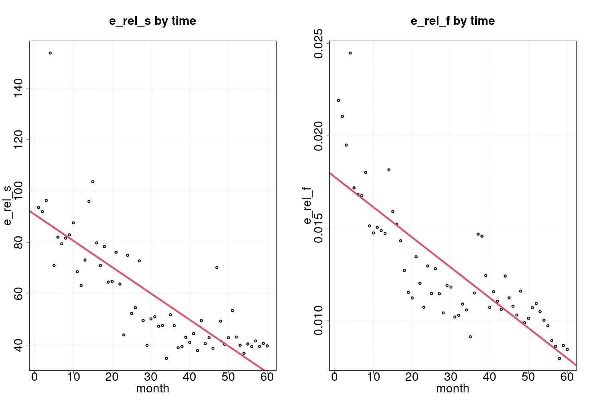

# Table of contents
- [Introduction](#introduction)
- [Methods](#methods)
  - organizations and posts
  - data cleaning
  - emoji descriptions
  - sentiment analysis
  - independent variables
  - dependent variable
- [Results](#results)
    - development over time
    - user engagement 
    - effects of sentiment measures 
    - effects of followers and post time 
- [Discussion](#discussion)
- [Appendix](#appendix)

# Introduction
- [TOC](#table-of-contents)

Formulate theoretically motivated hyptheses..

# Methods
- [TOC](#table-of-contents)

Convert readme in csv folder to running text..

## organizations and posts
- from crowdtangle ? (sh)
- facebook, ca 350K rows
- instagram, ca 350K rows

## normalize raw data (sh) 
- records, fix newlines
- delimiters, insert tabs
- unique record id, post id
- facebook, ca 240K rows

## clean, split, sample (sh)
- clean out N/A followers
- 240K to 120K post
- divide into 10K chunks
- randomize row order

## emojis to text (R)
- handle emojis in posts
- convert emoji to text

## match columns, rows
- to original 2018 dataset
- reassemble 100K rows

## sentiment analysis
- afinn dictionary (py)
- english for emoji text
- swedish for post text

## outlier detection (R)
- 1.5 interquartile range
- standardize, normalize measures

## data aggregation (R)
- 100K rows by 60 months

## modelling, visualization (R)
- linear models
- scatter plots

# Results
- [TOC](#table-of-contents)

The results of the survey will be presented in two steps. First, some general descriptive statistics will be presented, and secondly, we use inferential statistics to test the hypotheses H1-H3 provided by the theoretical models generated through the literature review of previous research. Descriptive statistics show .. visualize aggregated data, aggregate by organization (cf. Figure 1), [check appendix](#appendix)

## Measures over time

Figure 1

## User engagement

Positive relationships between user engagement and sentiment measures.

Figure 2

A number of measures were investigated for their explanatory contribution in relation to user engagement. Based on a theoretical model informed by previous research within organizational communication on social media, we hypothesized that user engagement would be positivey associated with the level of sentiment in textual post content (H1a-H1b). We also hypothesized that the dependent measure of user engagement would be positively associated with the number of users following an NGO Facebook page at the time of posting (H2). Finally, we hypothesized that later time of posting over the selected time period would be associated with higher level of user engagement (H3). To test these hypothesized associations, a mixed effects multiple regression analysis was performed using the statistical software R and the lme4 package, in which individual organization was treated as a random factor (cf. Table 1). 

### model
Table 1: Effects on user engagment

|term        | Estimate| Std..Error| t.value|   p.z|
|:-----------|--------:|----------:|-------:|-----:|
|(Intercept) |    0.063|      0.004|  14.268| 0.000|
|sa_val_norm |    0.008|      0.004|   2.292| 0.022|
|sa_int_norm |    0.034|      0.005|   7.331| 0.000|
|follow_norm |    0.008|      0.003|   2.887| 0.004|
|time_norm   |   -0.014|      0.003|  -5.009| 0.000|

## Effects of sentiment measures on user engagement
The text and emojis of individual posts on NGO Facebook pages were analyzed as several independent measures. Primarily, the dictionary-based AFINN sentiment analysis provided negative and positive valency scores (-5 to +5) for matching post words and emoji descriptions. These scores were summed up for each post, thereby resulting in the overall emotional valency measure of the post. Based on this valency construct, an emotional intensity measure was calculated as the square of emotional valency (cf. Methods). Both these measures were then normalized within each NGO in order to make measurements across organizations more comparable.

The results of the regression model strongly suggest that emotional valency in NGO Facebook posts is positively associated with user engagement (p<0.05, t=2.292). This significant effect means that the more positive valued words and emojis included in the post text, the higher level of user enagament might be expected. Vice versa, more neutral or negative sentiment in posts is predicted to be associated with lower engagement index scores. Our observational data thus provide support for hypothesis H1a: Positive emotional language is positively associated to user engagement.

Even though emotional valency was revealed to have a significantly positive relationship with user engagement, the regression model also indicates that emotional intensity has an even stronger effect on this dependent measure (p<0.05, t=7.331). Since sentiment intensity was operationalized as valency squared, we argue that this predictor is able to capture a second degree curvilinear effect of post sentiment on user engagement. Accordingly, this effect can be interpreted as U-shaped relationship in which both stronger negative and stronger positive sentiment are associated with increased engagement scores, whereas more neutral sentiment seems to generate lower engagement. 

Furthermore, the model shows that this predictor has a comparatively higher explanatory power, suggesting that a curvilinear effect is indeed better able to capture this effect than the first degree linear relationship expressed by emotional valency. Thus, the model also supports H1b: Intensity of emotional language is positively associated to user engagement. (H1x: Emotional language is positively associated to user engagement.)

## Effects of followers and post time on user engagement
Apart from the sentiment content of Facebook posts generated by NGO communicators, we also hypothesized that the number of page followers (size of the NGO community on FB) and the time of posting (over the period 2014-2019) would have some effects on user engagement. Arguably, these two variables can be regarded as controls of the previously discussed relationship between sentiment measures and user engagement. The followers measure was operationalized as the number of likes a Facebook page had at the time a post was created, while post time simply was represented by the millisecond UNIX timestamp of a post (cf. Methods). Both these measures were normalized within each NGO in order to make measurements across organizations more comparable.

The results of the regression model suggests that there is a strong positive relationship between the number of page followers at the time of posting and user engagement (p<0.05, t=2.887). This effects is fairly expected, since it basically captures the tendency that large NGO communities would be associated with higher levels of post engagement scores than smaller communities (or number of page subscribers who receive an NGO post on their Facebook timeline). Although this effect in itself can be regarded as somewhat trivial, it is still crucial that this variable is controlled for in the regression model as whole. Our social media measurements thus provide support for hypothesis H2: Number of page followers is positively associated to user engagement.

So far all predictors of user engagement have been positive. The only negative effect on user engagement in the regression model is associated with time (p<0.05, t=-5.009). This means that earlier posts in the time period 2014-2019 (i.e. lower timestamp) tend to generate higher engagement scores than later posts (i.e. higher timestamp). A possible interpretation of this effect is that the Facebook platform has grown considerably over the selected time period, thus contributing to increasing competition between NGO posts and other content on users' individual Facebook feeds. In this sense, the time variable could be regarded as a proxy of an intensified attention economy on social media. Another potential explanation would be that Facebook users tend to become less compassionate over the time period, and thus become less inclined to engage with NGO posts.

Like the number of followers variable discussed previously, the time of post variable represents an important control in model, and thus provides more reliability to the overall positive effects of sentiment content on user engagement. However, the negative effect of post time on user engagement is consistent with our theoretical model and thus provide support for hypothesis H3: Earlier time of post is positively associated to user engagement.

# Discussion
- [TOC](#table-of-contents)

not there yet..
- topic modelling av organisationer

# Appendix
- [TOC](#table-of-contents)

aggregate data by organization

Table: aggregate

|org                                   |    N| e_index_mean| e_index_sd| sa_val_mean| sa_val_sd| sa_int_mean| sa_int_sd| follow_mean| follow_sd|
|:-------------------------------------|----:|------------:|----------:|-----------:|---------:|-----------:|---------:|-----------:|---------:|
|ActionAidSweden                       |  680|        61.69|     215.26|        0.74|      5.55|       31.30|     83.27|    13759.15|   1420.06|
|actsvenskakyrkan                      | 1040|       245.89|     428.19|        1.77|      3.94|       18.62|     37.10|    19163.40|   5192.57|
|Afghanistankommitten                  |  899|       126.70|     249.50|        1.96|      4.55|       24.55|     57.21|    14307.73|   4328.89|
|Afrikagrupperna                       |  286|        60.31|     107.69|        1.11|      4.37|       20.25|     55.48|    10479.93|    779.79|
|Alzheimerfonden                       |  254|       236.78|     187.56|        1.75|      4.46|       22.85|     55.48|     8829.92|    341.91|
|AmnestySverige                        |  971|       618.28|     864.43|       -1.64|      5.16|       29.25|     64.39|    93597.20|   5602.07|
|AMREFNordic                           |  149|        35.11|     148.34|        1.99|      4.53|       24.32|     59.49|     1057.93|     67.86|
|AnhorigasRiksforbund                  |  941|        50.93|      67.99|        1.45|      4.41|       21.56|    117.36|     1731.23|    749.10|
|astmaallergiforbundet                 |  983|        93.15|     112.30|        1.46|      3.43|       13.92|     41.25|    11449.06|   3129.47|
|autismaspergersverige                 |  818|       276.36|     284.71|        1.63|      3.69|       16.28|     43.49|    23747.98|   3208.58|
|barncancerfonden                      | 1445|       607.29|     637.00|        2.71|      4.46|       27.23|     53.25|   111042.37|  19777.16|
|barndiabetesfonden                    |  753|       254.81|     506.39|        7.45|      8.12|      121.34|    204.96|    12882.94|   3926.04|
|Barnfonden                            |  819|       122.28|     545.05|        3.30|      4.63|       32.30|     58.38|    27980.30|    588.52|
|barnrattsbyransverige                 |  316|        77.62|      61.06|        3.29|      5.60|       42.16|     88.28|     2815.83|    532.32|
|berattarministeriet                   |  880|        47.85|      55.13|        3.27|      4.65|       32.33|     82.47|     5640.29|   1164.36|
|BirdLifeSverige                       |  971|       159.02|     236.71|        2.51|      4.85|       29.80|    121.99|    13579.86|   2208.42|
|Blomsterfonden                        |  212|        33.76|      36.94|        1.46|      2.72|        9.51|     22.04|     1346.52|     46.21|
|BRIS                                  |  935|       246.89|     623.56|        1.99|      4.36|       22.95|     46.16|    86262.01|   5668.69|
|brostcancerforbundet                  |  911|       180.70|     253.23|        2.50|      4.63|       27.65|     94.59|     4875.51|   1654.56|
|cancerfonden                          | 1149|      1427.49|    3254.47|        1.99|      3.79|       18.32|     36.51|   152398.99|  11865.91|
|celiakiforbundet                      |  350|       105.47|     142.55|        0.69|      2.91|        8.94|     29.19|    11783.34|   1591.62|
|childhoodsverige                      |  378|       454.92|     642.40|        1.12|      6.80|       47.37|     83.10|    22032.76|    761.27|
|civilrightsdefenders                  |  712|       103.81|     484.43|        1.11|      7.04|       50.69|    105.38|    41217.31|  10022.14|
|ClownerutanGranser                    | 1141|       151.88|     171.96|        6.22|      6.36|       79.10|    123.98|    13600.51|   2235.25|
|Diabetesfonden                        |   65|       154.42|     353.22|        2.66|      3.88|       21.89|     56.59|     6380.97|     80.08|
|diakonia.se                           |  464|       116.20|     267.92|        1.53|      3.74|       16.30|     34.61|    21924.22|    826.32|
|djurskyddet                           |  883|       251.47|     409.12|        1.75|      4.39|       22.34|     91.19|    27072.27|   1693.26|
|EcpatSverige                          |  477|       410.32|     510.96|        1.24|      4.89|       25.41|     49.41|    30949.94|   4173.21|
|emmausstockholm                       |  973|        31.28|      65.83|        1.60|      4.28|       20.87|     52.89|     3223.26|    491.96|
|Erikshjalpen                          | 1104|        59.92|      83.86|        2.21|      3.98|       20.71|     48.79|    11736.16|   1525.86|
|eskilstunastadsmission                |  450|       112.52|     128.93|        3.60|      4.32|       31.60|     60.36|     5198.74|    241.56|
|FairtradeSverige                      |  784|       200.61|     360.36|        2.82|      3.73|       21.84|     49.74|   111179.06|   1258.11|
|FNforbundet                           | 1011|        73.67|     198.56|        1.46|      3.61|       15.12|     34.08|    13871.89|   2362.45|
|fondenforpsykiskhalsa                 |  109|        32.80|     124.78|        1.37|      2.92|       10.34|     29.66|     1240.71|    194.05|
|foreningenfuruboda                    | 1179|        46.07|      50.84|        2.02|      3.58|       16.90|     85.36|     2074.06|    636.76|
|forskautandjurforsok                  |  341|       299.12|     353.17|        2.12|      5.74|       37.39|    214.38|    67307.82|   2559.71|
|fralsningsarmen                       | 1795|       477.39|    1003.66|        1.50|      3.29|       13.06|     30.00|    18428.56|   4771.77|
|FreezonenKvinnoTjejochBrottsofferjour |  240|        15.76|      32.11|       -0.55|      6.07|       36.95|    119.27|      724.81|    143.91|
|Friluftsframjandet                    |  493|       173.18|     454.25|        5.92|      5.15|       61.47|     97.47|    33490.01|   6286.52|
|friskfri                              | 1069|        54.76|      61.04|        2.23|      6.48|       46.94|    105.16|     5201.38|   1108.07|
|fryshuset                             |  323|        27.48|      31.73|        2.75|      4.49|       27.68|     65.63|    11025.63|    297.14|
|GbgStadsmission                       | 1392|       111.35|     274.45|        4.16|      6.02|       53.61|    152.87|     9628.61|   1534.02|
|hallsverigerent                       |  614|       292.15|     730.87|        1.30|      3.19|       11.85|     33.52|    21252.26|   5629.01|
|hela.manniskan                        |  538|        67.46|     222.34|        0.99|      2.79|        8.72|     78.38|     1581.19|    805.24|
|hjarnfonden                           | 1262|       351.98|     691.08|        2.37|      4.81|       28.77|    139.60|    22519.40|   8595.54|
|Hjartebarnsfonden                     |  738|       165.56|     215.63|        4.75|      6.22|       61.24|    115.54|     7657.91|    443.23|
|hjartlungfonden                       |  815|       138.69|     382.53|        2.16|      3.93|       20.10|     38.52|    37859.57|   1183.13|
|HRFriks                               | 1358|        67.41|      65.38|        2.07|      4.23|       22.18|     43.11|     3316.66|    726.28|
|HRWSweden                             |  727|         5.52|       8.36|       -1.43|      4.65|       23.58|     49.69|     1148.72|    526.29|
|imsweden.org                          | 1435|        89.80|     234.54|        1.78|      4.64|       24.67|     51.14|    12939.64|   2517.34|
|iogtnto                               |  825|       162.00|     210.31|        0.76|      3.26|       11.18|     30.39|    10521.36|   1318.33|
|IslamicReliefSverige                  | 1523|        71.57|     186.05|        2.89|      5.54|       39.01|     82.25|    14959.82|   2751.00|
|kalmarstadsmission                    | 1122|        77.10|      78.03|        2.42|      3.71|       19.61|     54.41|     3307.87|   1103.27|
|kfumsverige                           |  704|        18.93|      24.27|        1.86|      3.19|       13.63|     31.82|     2811.74|    193.62|
|kristnafreds                          | 1225|        25.56|      24.50|        2.23|      4.75|       27.55|     65.34|     2343.06|    227.32|
|kvinnatillkvinna                      | 1082|       273.14|    1686.41|        0.53|      5.54|       30.98|     71.60|    41220.62|   6492.72|
|lakareivarlden                        |  569|        58.62|      98.88|        0.79|      4.66|       22.28|     92.41|     4760.17|    917.84|
|lakareutangranser                     | 1272|       779.18|    2533.48|       -0.50|      3.71|       14.01|     33.58|   386301.44|   7224.80|
|Lakarmissionen                        |  231|       301.31|     831.36|        3.52|      5.09|       38.19|     70.50|    26709.81|    230.52|
|Latinamerikagrupperna                 |  169|        25.36|      25.94|        0.46|      4.35|       19.04|     65.14|     6663.14|     20.00|
|Laxhjalpen                            |  696|        20.25|      16.90|        4.57|      4.98|       45.64|    129.69|     2153.84|    346.67|
|lillabarnet                           |  144|       109.59|     459.37|        4.11|      5.21|       43.85|    108.83|     2510.20|    202.16|
|linkopingsstadsmission.fb             | 1588|        50.84|      94.84|        2.71|      4.77|       30.09|     75.98|     4936.91|    990.48|
|Mattecentrum                          | 1146|        59.45|      89.76|        3.52|      3.91|       27.62|     64.19|    25031.70|   2281.47|
|mentorsverige                         |  653|        48.86|      70.85|        2.84|      5.31|       36.19|    112.99|     8747.41|   1096.65|
|mindsweden                            |  943|       232.52|     419.26|        0.85|      3.88|       15.77|     32.96|    22751.79|   6398.60|
|minstoradag                           |  832|      1079.75|    2291.10|        4.62|      6.11|       58.63|    126.46|    86494.54|   9610.88|
|MPSweden                              |  159|      2000.22|    3142.28|        2.50|      5.01|       31.21|    100.37|   630712.94|  35602.02|
|neurosweden                           |  518|        72.73|     104.13|        1.55|      4.22|       20.20|     41.09|    15792.74|    308.45|
|nhjalp                                |  230|        30.28|      70.75|        1.78|      3.89|       18.26|     66.57|     2333.61|    814.02|
|Njurfonden                            |  161|       131.02|     270.47|        2.68|      5.61|       38.42|    105.83|     1055.81|    273.74|
|nonsmokinggeneration                  | 1063|        40.30|      47.73|        1.49|      4.01|       18.27|     42.05|     5119.72|    290.52|
|Nordensark                            |  517|       239.68|     273.44|        3.16|      4.21|       27.68|     55.70|    19762.67|    828.68|
|operationsmilesverige                 |  982|       589.69|     805.25|        4.14|      5.18|       43.90|     89.88|    24605.99|   4568.43|
|organisationen.man                    |  817|       149.78|     240.03|       -0.48|      5.90|       34.99|     99.80|    16909.88|   3856.92|
|oxfamsverige                          |  670|       196.85|     586.01|        0.07|      4.85|       23.48|     44.36|    13310.01|   2986.42|
|palestinagrupperna                    |  482|        88.78|     128.50|        0.61|      6.29|       39.83|    285.08|     7636.94|    543.69|
|parasportSWE                          |  730|        75.73|      65.83|        1.55|      2.43|        8.29|     17.53|     4736.68|    613.20|
|PlanSverige                           | 1162|       653.44|    1120.80|        1.05|      5.62|       32.69|     79.16|    57794.61|   8784.30|
|PMUfb                                 |  790|       105.32|     192.08|        2.30|      4.39|       24.53|     60.28|     5628.11|   1228.16|
|prostatacancerforbundetsverige        |  170|       197.89|     176.35|        2.07|      3.28|       14.96|     34.37|    24279.66|   1593.16|
|Psoriasisforbundet                    |  545|        58.15|      48.85|        2.58|      3.81|       21.13|     58.61|     5470.10|    299.81|
|raddabarnen                           |  862|       963.22|    2741.99|        0.60|      5.28|       28.25|     46.09|   156626.83|  17387.10|
|raddningsmissionen                    | 1327|        97.81|     137.02|        6.52|      8.72|      118.57|    770.00|    12551.52|   1740.09|
|RaoulWallenbergAcademy                |  527|        98.39|     188.98|        2.85|      5.27|       35.82|     89.52|     7810.80|    843.09|
|rburiks                               | 1097|       107.01|     136.34|        1.02|      2.80|        8.86|     26.44|     3544.66|    932.37|
|reachforchangeorg                     |  824|        16.94|      19.67|        6.08|      6.90|       84.50|    187.53|    10451.76|    457.86|
|Reumatikerforbundet                   | 1137|        99.83|      96.40|        1.34|      3.76|       15.95|     41.70|    10907.23|    633.67|
|rfsl.forbundet                        | 1253|       141.51|     300.17|        1.84|      5.00|       28.31|     90.15|    16334.21|   3378.31|
|rfsu.se                               |  621|       158.40|     950.38|        1.69|      5.43|       32.30|    131.98|    15730.48|   1576.04|
|rightlivelihood                       |  539|        43.58|     203.04|        2.37|      6.74|       51.01|    106.84|    13498.38|   1270.23|
|RiksforbundetHjartLung                |  752|       113.09|     142.41|        2.57|      4.24|       24.59|     53.86|     6618.44|   4822.72|
|rodakorset                            |  851|       837.22|    1176.03|        0.52|      3.81|       14.75|     30.92|   154582.93|  16987.95|
|savetheorangutan.sverige              | 1181|       248.34|     274.26|        4.91|      5.52|       54.57|     98.81|     9449.83|   1203.02|
|scouterna                             |  901|       105.40|     233.44|        4.04|      4.46|       36.15|     65.73|    19195.23|    619.53|
|sjoraddning                           | 1034|       471.63|     460.31|        2.82|      4.25|       26.00|     52.95|    66985.21|   5353.00|
|skanestadsmission                     | 1185|       155.84|     168.28|        2.78|      4.33|       26.47|     66.46|     8341.26|   2364.79|
|SLMK.1981                             |  958|        44.63|      55.20|        1.02|      3.49|       13.18|     25.00|     1819.98|    252.87|
|sosbarnbyar                           |  956|       168.26|     314.14|        3.06|      5.34|       37.89|     67.59|    44470.25|   2237.20|
|spadbarnsfonden                       |  190|        96.58|     180.04|        3.60|      5.94|       48.01|     95.56|     7288.82|    163.56|
|Sportfiskarna                         |  644|       151.08|     403.59|        2.51|      4.15|       23.54|     59.61|    14315.17|   3182.79|
|stadsmissionen                        | 1001|       227.83|     633.78|        2.70|      3.88|       22.39|     47.81|    24082.07|   5844.93|
|stadsmissioniorebro                   |  613|        65.71|      87.64|        3.06|      4.02|       25.49|     60.11|     3756.41|    461.89|
|starforlifeofficial                   |  297|        63.87|      63.15|        4.86|      6.53|       66.13|    166.48|     8765.29|    298.99|
|StiftelsenFriends                     |  811|       712.43|    4860.73|        0.52|      5.07|       25.98|     69.84|    72514.42|   7689.76|
|suicidezero                           |  263|       450.58|     549.82|        0.93|      6.18|       38.88|    100.02|    64008.13|   2312.06|
|svenskafreds                          | 1275|       103.28|     165.30|        1.26|      5.56|       32.49|    100.51|    12021.34|   1364.47|
|svenskalivraddningssallskapet         |  524|        85.96|     133.60|        1.89|      3.51|       15.83|     43.24|    32147.31|    304.70|
|sverigeforunhcr                       | 1132|       384.05|     666.16|        1.71|      4.49|       23.04|     48.06|    65812.08|  11779.81|
|sverigesstadsmissioner                |  631|        28.67|      27.21|        1.01|      4.00|       17.04|     44.88|     1620.16|    144.76|
|TeachForSweden                        |  626|        21.99|      18.08|        3.84|      4.81|       37.76|     93.08|     3180.63|    896.53|
|Teskedsorden                          |  286|        53.91|      57.99|        1.41|      6.38|       42.54|     78.09|     5120.26|    293.80|
|thehungerprojectse                    |  980|        20.21|      23.16|        1.76|      4.09|       19.81|     45.33|     4421.66|   1508.67|
|Tjejzonen                             |  524|        66.72|     114.50|        4.54|      6.84|       67.38|    126.74|     5156.98|    984.37|
|ungcancer                             | 1151|       437.13|     940.11|        2.20|      6.54|       47.53|    103.77|   151239.65|   1160.86|
|UNICEF-Sverige                        |  955|      1111.97|    3250.36|        1.70|      5.18|       29.66|     54.39|   306713.90|  12509.40|
|uppsalastadsmission                   | 1334|        82.82|     144.69|        4.31|      4.31|       37.14|     60.64|     3948.21|   1258.89|
|vasterasstadsmission                  |  762|        68.16|     230.66|        3.25|      5.26|       38.18|    111.04|     5568.80|    636.76|
|viskogen                              |  472|       806.33|     943.54|        3.50|      4.61|       33.49|     66.90|    53655.01|   9048.02|
|warchildsverige                       |  738|        29.38|      36.96|        3.56|      5.31|       40.87|     77.52|     3307.28|   1458.46|
|wateraidswe                           |  995|        78.00|     198.77|        2.07|      4.66|       26.01|     53.80|     7213.34|   2984.03|
|weeffect                              |  525|       240.19|     700.03|        2.21|      4.28|       23.15|     56.46|    64381.99|   6554.56|
|WikimediaSverige                      |  570|        34.01|     108.91|        2.94|      4.58|       29.54|     92.89|     2824.34|   1803.25|
|WorldAnimalProtectionSverige          | 1262|      1018.28|    1334.48|        0.96|      4.51|       21.25|     42.19|    85681.24|  10013.07|
|worldschildrensprize                  |  270|       792.31|    2102.12|        2.64|      6.10|       44.05|     87.87|   143251.16|   2073.82|

