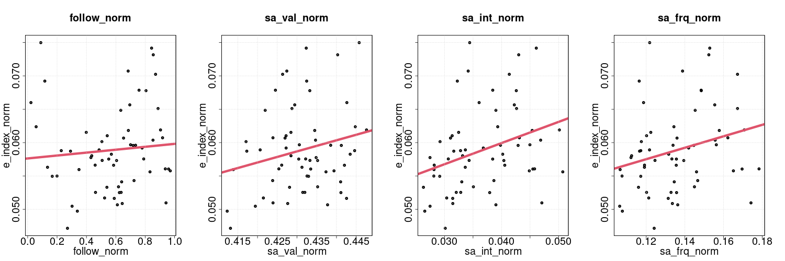

# Abstract
methods, results

# Introduction
formulate hyptheses

# Methods
take a look in csv folder

## raw data dump (sh)
- from crowdtangle ?
- facebook, ca 350K rows
- instagram, ca 350K rows

## normalize raw data (sh) 
- records, fix newlines
- delimiters, insert tabs
- unique record id, post id
- facebook, ca 240K rows

## clean, split, sample (sh)
- clean out N/A followers
- 240K to 120K post
- divide into 10K chunks
- randomize row order

## emojis to text (R)
- handle emojis in posts
- convert emoji to text

## match columns, rows
- to original 2018 dataset
- reassemble 100K rows

## sentiment analysis (py)
- afinn dictionary
- english for emoji text
- swedish for post text

## outlier detection (R)
- 1.5 interquartile range
- standardize, normalize measures

## data aggregation (R)
- 100K rows by 60 months

## modelling, visualization (R)
- linear models
- scatter plots

# Results
The results of the survey will be presented in two steps. First, some general descriptive statistics will be presented, and secondly, we use inferential statistics to test the hypotheses H1-H3 provided by the theoretical models generated through literature review of previous research. Descriptive statistics show .. visualize aggregated data, aggregate by organization (cf. Figure 1), 

Figure 1

Positive relationships between user engagement and sentiment measures.

Figure 2

A number of measures were investigated for their explanatory contribution in relation to user engagement. Based on the theoretical model informed by previous research within organizational communication on social media, we hypothesized that user engagement would be positivey associated with sentiment in textual post content (H1a-H1c). We also hypothesized that this dependent measure would be positively associated with the number of followers of NGO Facebook pages (H2). Finally, we hypothesized that later time of post over the selected time period would be associated with higher levels user engagement (H3).

### model
Table 1: Effects on user engagment

|term        | Estimate| Std..Error| t.value|   p.z|
|:-----------|--------:|----------:|-------:|-----:|
|(Intercept) |    0.063|      0.004|  14.268| 0.000|
|sa_val_norm |    0.008|      0.004|   2.292| 0.022|
|sa_int_norm |    0.034|      0.005|   7.331| 0.000|
|follow_norm |    0.008|      0.003|   2.887| 0.004|
|time_norm   |   -0.014|      0.003|  -5.009| 0.000|

## Effects of sentiment measures on user engagement
three measures stated in h1a-h1c

### Post text sentiment valency
moved values to positive scale.. 

### Post text sentiment intensity
operationalized as valency squared.. also include frequency measure ?

## Effects of page followers on user engagement
control variable 

## Effects of period time point on user engagement 
control variable 

# Discussion
not there yet..

